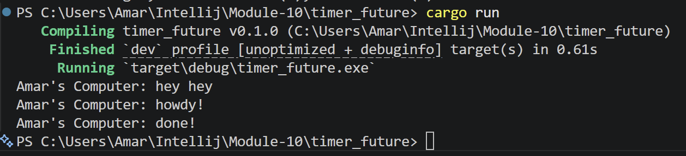
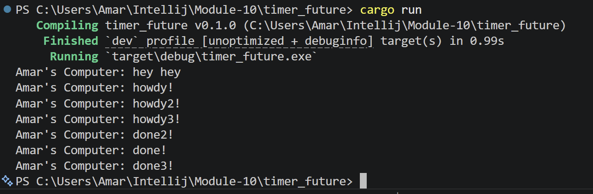

## Experiment 1.2 - Understanding How It Works



Di experiment ini aku nambahin satu `println!()` setelah `spawner.spawn(...)`.

```rust
println!("Amar's Computer: hey hey");
```
Pas program dijalankan, output yang muncul malah:
- Amar's Computer: hey hey
- Amar's Computer: howdy!
- Amar's Computer: done!

Awalnya aku kira howdy! bakal muncul duluan, tapi ternyata hey hey yang muncul dulu. Hal ini terjadi karena spawner.spawn(...) sebenarnya belum langsung menjalankan async task-nya. Spawn cuma memasukkan task ke dalam queue milik executor.

Task async baru benar-benar dijalankan saat executor.run() dipanggil. Karena itu, kode biasa setelah spawn() masih dijalankan dulu secara normal sebelum executor mulai memproses future yang ada. Setelah executor berjalan, task async mulai dipoll, lalu muncul howdy!, delay 2 detik, dan akhirnya selesai deh.

## Experiment 1.3 - Multiple Spawn and Removing Drop



Di experiment ini aku coba nambah beberapa `spawn()` supaya ada beberapa async task yang jalan bareng.

```rust
spawner.spawn(async {
    println!("Amar's Computer: howdy!");
    TimerFuture::new(Duration::new(2, 0)).await;
    println!("Amar's Computer: done!");
});

spawner.spawn(async {
    println!("Amar's Computer: howdy2!");
    TimerFuture::new(Duration::new(2, 0)).await;
    println!("Amar's Computer: done2!");
});

spawner.spawn(async {
    println!("Amar's Computer: howdy3!");
    TimerFuture::new(Duration::new(2, 0)).await;
    println!("Amar's Computer: done3!");
});
```

Pas dijalankan, semua howdy muncul dulu sebelum semua done. Hal ini itu terjadi krn setiap task async dijalankan sampai ketemu .await. Setelah ketemu .await, task akan pause sementara dan executor pindah menjalankan task lain.

Makanya output awalnya jadi:
- howdy!
- howdy2!
- howdy3!
Setelah timer selesai sekitar 2 detik, executor lanjut menjalankan task-task tadi dan muncul:
- done!
- done2!
- done3!

Urutan done juga bisa berubah-ubah karena async task dijalankan secara concurrent oleh executor. Selain itu aku juga coba menghapus: `drop(spawner);`
Saat drop(spawner) dihapus, program jadi tidak berhenti dan terus running. Hal ini terjadi karena executor masih mengira bakal ada task baru yang masuk ke queue. Jadi executor terus menunggu task baru dari spawner.

Dari experiment ini aku jadi lebih ngerti kalau:
- Spawner dipakai untuk mengirim task async ke queue
- Executor dipakai untuk menjalankan dan mem-poll task
- drop(spawner) dipakai untuk memberi tahu executor kalau sudah tidak ada task baru lagi